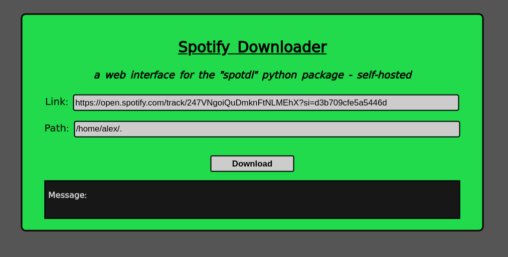

# WebUI wrapper for Spotdl using Flask

made a webUI to download songs via spotdl. Used Flask in the backend and a simple html/css for the front-end.

The UI takes the spotify song/playlist/album URL along with the download path, and downloads it for you in the given path.

(an excuse to try the Flask library for the first time)

### Docker version

`spotdl` (https://github.com/spotDL/spotify-downloader) already supports a webUI with the option "web". I tried to create a dockerfile that builds the image with the spotdl package downloaded and all permissions set to the download directory which can be mapped to the desired location on the host machine.

To start the app as a container -

`docker run -d --restart always -e UID=$(id -u) -e GID=$(id -g) -v <location to store music on host>:/tmp/music -p <port on host>:8800 ghcr.io/saicharan0112/spotdl:latest`

